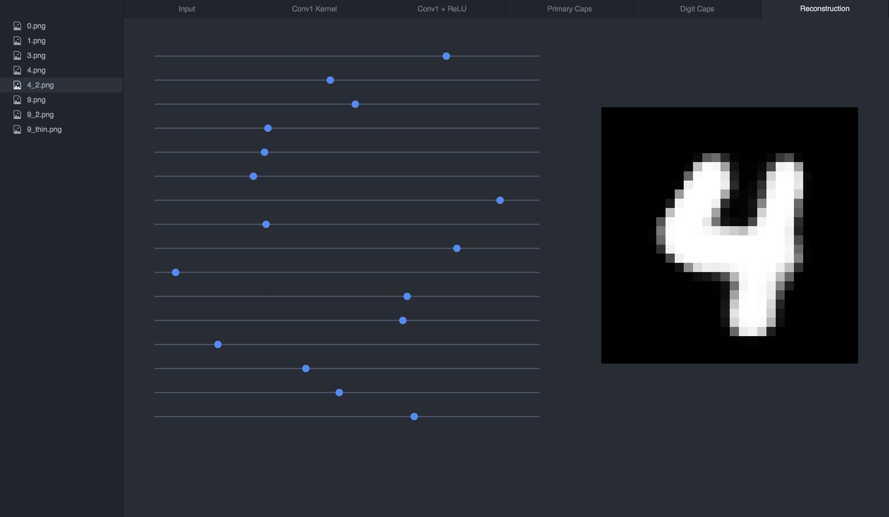

# CapsNet-Visualization



## Setup

Use pip to install the required python packages:

```bash
pip install -r requirements.txt
```

## Running the Tool

Start the Flask application by running:

```bash
python run_visualization.py
```

Point your browser to: http://localhost:5000

## Testing your own Images

Add your images to the `test_images` directory.

Run:
```bash
python render.py [filename]
```
